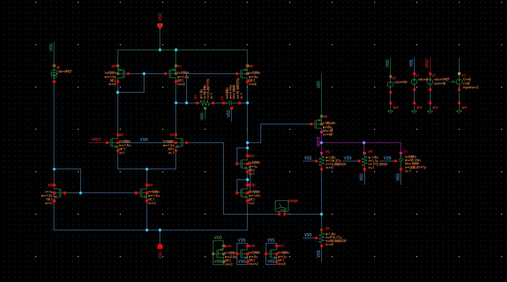

# Analog-LDO-Design

A transistor-level design of a Low Dropout Voltage Regulator implemented in **UMC/SCL 180nm CMOS technology**, simulated and verified in **Cadence Virtuoso**. This project was completed as a capstone project at KLE Technological University.

## Overview

LDO regulators are essential building blocks in low-power analog systems, providing a stable, noise-free supply voltage with minimal input-output voltage difference. This design targets applications in **medical devices, IoT, and agriculture electronics**, where power efficiency and reliability are critical.

The regulator delivers a stable **1.5V output from a 1.2V bandgap reference**, sourced from a **1.8V supply**, using a fully transistor-level analog design flow — from hand calculations to schematic-level simulation and layout.

## Architecture

The design consists of four main blocks:

- **PMOS Pass Transistor** — sized for up to 10 mA of load current with low dropout voltage
- **Two-Stage Error Amplifier**
  - Stage 1: PMOS differential pair with diode-connected NMOS load
  - Stage 2: Common-source gain stage
- **Resistive Feedback Network** — sets the output voltage via R1/R2 divider
- **Miller (RC–CC) Frequency Compensation** — stabilizes the loop across process corners

## Schematic

  ## Design Specifications

| Parameter | Target Value |
|---|---|
| Technology | 180 nm CMOS |
| Output Voltage (V_OUT) | 1.5 V |
| Reference Voltage (V_REF) | 1.2 V |
| Max Load Current | 10 mA |
| Quiescent Current | < 40 µA |
| Dropout Voltage | 300 mV |
| DC Loop Gain | > 55 dB |
| Phase Margin | > 55° |
| Output Capacitance | 200 pF |
| 3dB Bandwidth | > 30 kHz |

## Simulation Results

| Metric | Simulated Result |
|---|---|
| DC Loop Gain | 55.39 dB |
| Phase Margin | 55.14° |
| Unity Gain Crossover | 7.2048 MHz |
| Output Voltage (at V_IN = 1.8V) | 1.486 V |
| Load Regulation (0–10 mA) | ΔV_OUT ≈ 3.3 mV (0.33 Ω) |
| Dropout onset | ~1.5 V input |

All simulations were performed in Cadence Virtuoso, including:
- **AC Analysis** — loop gain magnitude/phase across process corners
- **DC Analysis** — V_OUT vs. V_IN sweep
- **Load Regulation** — V_OUT vs. I_LOAD (0–10 mA)
- **Layout** — transistor-level layout following 180nm design rules
## Key Design Decisions

- A **diode-connected NMOS load** in the first amplifier stage was chosen for simplicity while still meeting the gain budget.
- **Miller compensation** (RC–CC network) pushes the dominant pole to ~25 kHz and introduces a feedforward zero to improve phase margin without excessive area overhead.
- The pass transistor gate capacitance (Cgs ≈ 350 fF, extracted from Cadence) sets the second pole (~200 kHz), which was accounted for in the compensation strategy.
- Feedback divider current was kept to ~3 µA to preserve the overall quiescent current budget.

## Future Work

- On-chip bandgap reference integration (removing dependence on external V_REF)
- Adaptive/process-corner-robust compensation for improved worst-case phase margin
- PSRR and transient load-response characterization under dynamic conditions
- Tape-out and silicon-level verification

## Tools Used

- **Cadence Virtuoso** (Schematic Capture, ADE, Layout)
- **180nm CMOS PDK**

## References

See the full project report for detailed literature review and citations on comparable LDO architectures (SCL 180nm designs, folded-cascode topologies, and low-quiescent-current techniques).
